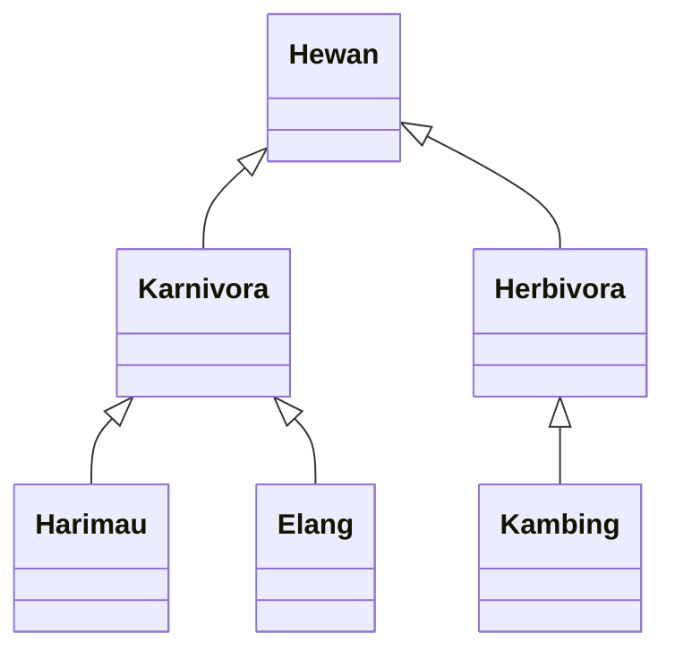

# Inheritance (cont.)

- Java hanya mengizinkan **single inheritance**, yakni _subclass_ hanya dapat memiliki **satu** _parent class_.

- Satu _parent class_ dapat memiliki **banyak** _subclass_ yang disebut **hierarchical inheritance**.

- Satu _subclass_ dapat memiliki _subclass_ lagi, disebut **multilevel inheritance**.

- Java tidak mendukung multiple inheritance, yakni satu _subclass_ memiliki **lebih dari satu** _parent class_.

