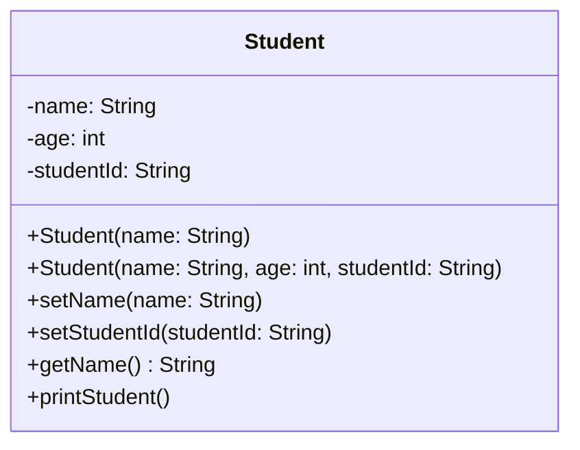

# Class Diagram (cont.)

```mermaid
classDiagram
    class Student {
        -name: String
        -age: int
        -studentId: String
        +Student(name: String)
        +Student(name: String, age: int, studentId: String)
        +setName(name: String)
        +setStudentId(studentId: String)
        +getName() String
        +printStudent()
    }
```

