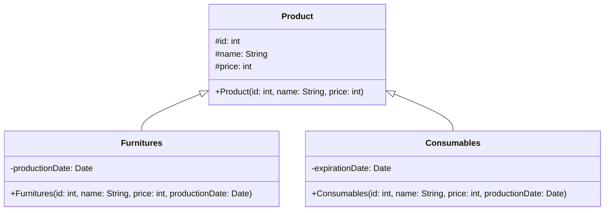

# Hubungan Antar Kelas

 

**Inheritance/ Pewarisan** yakni membuat sebuah subclass dari class yang sudah ada. Hubungan ini disebut juga hubungan _spesialisasi_ dan berkebalikan dengan hubungan _generalisasi_.

