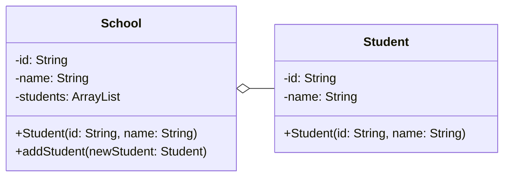

# Hubungan Antar Kelas (cont.)

 

**Aggregation** merupakan hubungan antara class (entity) dengan dependency yang memiliki lifespan berbeda. Jika 1 class telah mati, tetapi dependency **tidak akan ikut mati**.

