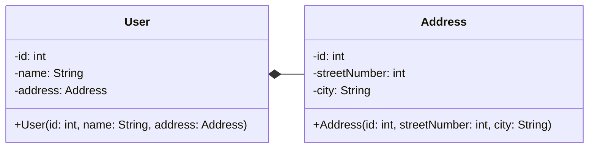

# Hubungan Antar Kelas (cont.)

 

**Composition** merupakan hubungan antara class (entity) dengan dependency yang memiliki lifespan sama. Jika 1 class telah mati, maka dependency pun **akan ikut mati**.

