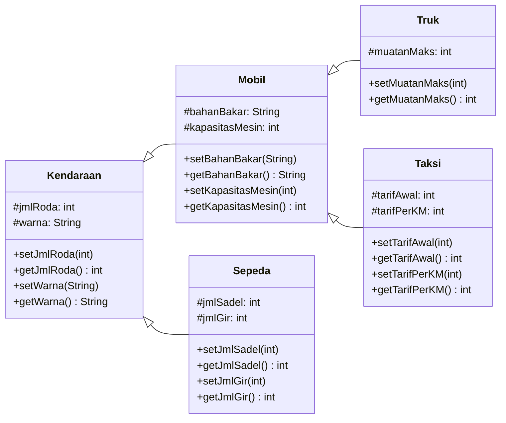

# Mengimplementasikan UML Diagram

Class diagram dari tabel sebelumnya sebagai berikut.

```mermaid
classDiagram
    direction LR
    Kendaraan <|-- Mobil
    Kendaraan <|-- Sepeda
    Mobil <|-- Truk
    Mobil <|-- Taksi
    class Kendaraan {
        #jmlRoda: int
        #warna: String
        +setJmlRoda(int)
        +getJmlRoda() int
        +setWarna(String)
        +getWarna() String
    }
    class Mobil {
        #bahanBakar: String
        #kapasitasMesin: int
        +setBahanBakar(String)
        +getBahanBakar() String
        +setKapasitasMesin(int)
        +getKapasitasMesin() int
    }
    class Sepeda {
        #jmlSadel: int
        #jmlGir: int
        +setJmlSadel(int)
        +getJmlSadel() int
        +setJmlGir(int)
        +getJmlGir() int
    }
    class Truk {
        #muatanMaks: int
        +setMuatanMaks(int)
        +getMuatanMaks() int
    }
    class Taksi {
        #tarifAwal: int
        #tarifPerKM: int
        +setTarifAwal(int)
        +getTarifAwal() int
        +setTarifPerKM(int)
        +getTarifPerKM() int
    }
```

